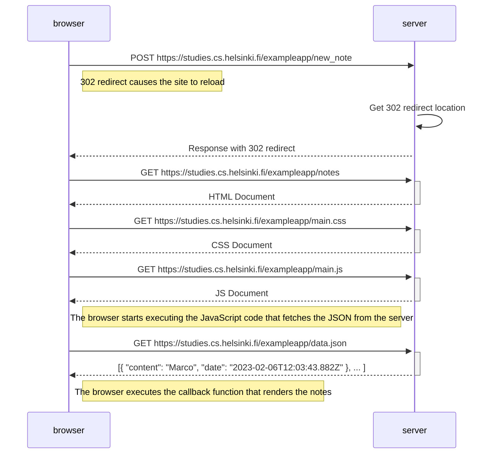

```mermaid
sequenceDiagram
    participant browser
    participant server
    
    browser->>server: POST https://studies.cs.helsinki.fi/exampleapp/new_note
    Note right of browser: 302 redirect causes the site to reload
    activate server
    server->>server: Get 302 redirect location
    server-->>browser: Response with 302 redirect
    
    browser->>server: GET https://studies.cs.helsinki.fi/exampleapp/notes
    activate server
    server-->>browser: HTML Document
    deactivate server
    
    browser->>server: GET https://studies.cs.helsinki.fi/exampleapp/main.css
    activate server
    server-->>browser: CSS Document
    deactivate server
    
    browser->>server: GET https://studies.cs.helsinki.fi/exampleapp/main.js
    activate server
    server-->>browser: JS Document
    deactivate server
    Note right of browser: The browser starts executing the JavaScript code that fetches the JSON from the server
    
    browser->>server: GET https://studies.cs.helsinki.fi/exampleapp/data.json
    activate server
    server-->>browser: [{ "content": "Marco", "date": "2023-02-06T12:03:43.882Z" }, ... ]
    deactivate server
    Note right of browser: The browser executes the callback function that renders the notes 
```
