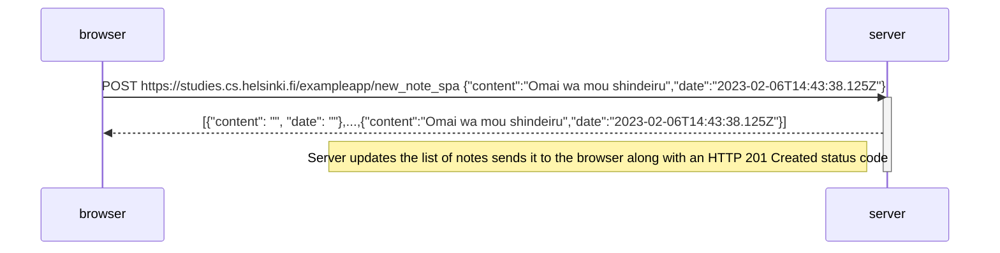

```mermaid
sequenceDiagram
    participant browser
    participant server

    browser->>server: POST  https://studies.cs.helsinki.fi/exampleapp/new_note_spa {"content":"Omai wa mou shindeiru","date":"2023-02-06T14:43:38.125Z"}
    activate server
    server-->>browser: [{"content": "", "date": ""},...,{"content":"Omai wa mou shindeiru","date":"2023-02-06T14:43:38.125Z"}]
    Note left of server: Server updates the list of notes sends it to the browser along with an HTTP 201 Created status code 
    deactivate server
```
